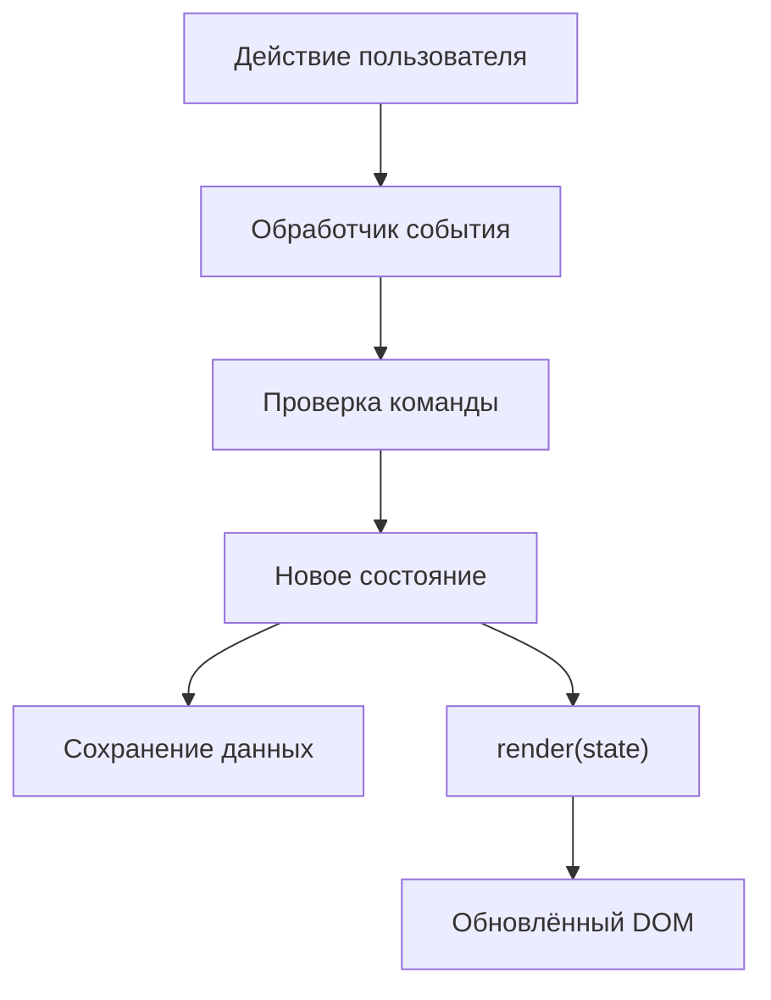
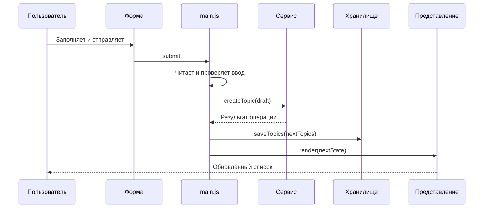

# Лекция № 2

**Тема: Разработка интерактивного интерфейса средствами JavaScript**

- **Дисциплина:** Технологии индустриального программирования
- **Трек:** фулстек-разработка на JavaScript
- **Связанные практические работы:** [ПР3 — DOM и события](../../practices/practice-03/README.md), [ПР4 — формы, валидация и локальное хранение](../../practices/practice-04/README.md)
- **Демонстрационный пример:** [интерактивный список тем](./demo/)

[К описанию курса](../../README.md) · [К ПР3](../../practices/practice-03/README.md) · [К ПР4](../../practices/practice-04/README.md) · [Запустить пример](#11-демонстрационный-пример)

> Центральная идея лекции: интерфейс является отображением состояния приложения. Пользовательское событие преобразуется в команду, команда изменяет состояние, после чего интерфейс строится заново из актуальных данных.

## 1. Место лекции в курсе

На первом этапе курса JavaScript использовался для вычислений, работы с функциями, объектами и массивами. Такой код мог выполняться в Node.js или в консоли браузера, но ещё не образовывал полноценного пользовательского интерфейса.

На этом этапе язык связывается с возможностями браузера:

- HTML задаёт исходную структуру и смысл элементов;
- CSS отвечает за представление;
- JavaScript хранит состояние, реагирует на действия пользователя и изменяет документ через Web API;
- DOM предоставляет программную модель открытой страницы;
- события сообщают о действиях пользователя и изменениях среды;
- формы организуют ввод данных;
- `localStorage` позволяет сохранить небольшой объём состояния между перезагрузками.

После лекции должно быть понятно не только **как** изменить текст или обработать кнопку, но и **как организовать код**, чтобы данные, отображение, события и хранение не смешивались в одном наборе обработчиков.

### 1.1. Результаты обучения

После изучения материала необходимо уметь:

1. объяснить различие между HTML-текстом, DOM-деревом и JavaScript-объектами предметной области;
2. находить, создавать, изменять и удалять DOM-элементы;
3. выводить пользовательские значения как текст без интерпретации их как HTML-разметки;
4. описать фазы распространения события и различие между `target` и `currentTarget`;
5. применять делегирование событий для динамически создаваемых элементов;
6. обрабатывать форму через событие `submit` и объект `FormData`;
7. разделять нативную проверку формы, прикладную валидацию и правила модели;
8. сериализовать данные в JSON и безопасно восстанавливать их из `localStorage`;
9. строить интерфейс по схеме «состояние → отображение»;
10. диагностировать типичные ошибки через DevTools.

### 1.2. Ориентировочный план занятия

| Этап | Время | Содержание |
|---|---:|---|
| Постановка задачи | 5 минут | Почему изменения отдельных элементов недостаточно для приложения. |
| DOM и построение элементов | 20 минут | Дерево документа, поиск, создание, безопасный текст. |
| Состояние и рендеринг | 15 минут | Единый источник данных, производные значения, повторная отрисовка. |
| События | 15 минут | Обработчики, всплытие, `target`, `currentTarget`, делегирование. |
| Формы и валидация | 15 минут | `submit`, `FormData`, уровни проверки. |
| JSON и `localStorage` | 10 минут | Сериализация, схема данных, обработка ошибок. |
| Демонстрация и выводы | 10 минут | Разбор работающего примера и подготовка к ПР3–ПР4. |

Распределение времени является ориентиром. При разборе ошибок и вопросов отдельные блоки могут занимать больше времени.

## 2. От статической страницы к приложению

Статическая страница заранее описана в HTML. Интерактивное приложение должно учитывать изменяющиеся данные: выбранный фильтр, введённый текст, добавленные записи, результат проверки, состояние загрузки и ошибки.

Рассмотрим список учебных тем:

```js
const topics = [
  { id: 1, title: "DOM-дерево", completed: true },
  { id: 2, title: "Делегирование событий", completed: false },
];
```

Массив является данными приложения. Элементы `<li>`, которые видит пользователь, являются представлением этих данных. Это разные сущности:

| Сущность | Пример | Назначение |
|---|---|---|
| Модель данных | объект `{ id, title, completed }` | Хранит сведения предметной области. |
| Состояние интерфейса | `filter`, `editingId`, текст сообщения | Описывает текущий режим интерфейса. |
| DOM | `<li>`, `<button>`, `<span>` | Представляет состояние на странице. |
| Постоянное хранение | JSON в `localStorage` | Восстанавливает данные после перезагрузки. |

Если изменить только текст кнопки, но не изменить модель, интерфейс и данные начнут противоречить друг другу. Если изменить массив, но не обновить DOM, пользователь не увидит результат. Поэтому требуется явный цикл обновления.



Сохранение выполняется только для тех данных, которые действительно должны пережить перезагрузку. Например, выбранный фильтр можно оставить временным, а список записей — сохранить.

## 3. DOM как программная модель документа

### 3.1. HTML и DOM — не одно и то же

HTML-файл содержит исходную разметку. После его чтения браузер строит объектное дерево — DOM. JavaScript работает не с текстом файла, а с объектами этого дерева.

```html
<section id="topics">
  <h2>Темы</h2>
  <ul class="topic-list"></ul>
</section>
```

Упрощённое дерево:

```text
Document
└── html
    └── body
        └── section#topics
            ├── h2
            │   └── Text("Темы")
            └── ul.topic-list
```

Не каждый узел является элементом: текст внутри заголовка представлен отдельным текстовым узлом. На практике чаще всего используются объекты `Document`, `Element` и `HTMLElement`, но различие узлов важно при навигации по дереву.

DOM относится к Web API браузера, а не к ядру языка JavaScript. Поэтому в обычной среде Node.js объектов `document` и `window` нет.

### 3.2. Поиск элементов

Для поиска по CSS-селектору используются `querySelector` и `querySelectorAll`:

```js
const list = document.querySelector("#topic-list");
const filterButtons = document.querySelectorAll("[data-filter]");
```

Контракты различаются:

- `querySelector` возвращает первый подходящий элемент или `null`;
- `querySelectorAll` возвращает статический `NodeList`, который может быть пустым;
- ранее полученный `NodeList` не пополняется при создании новых элементов;
- ссылка на найденный DOM-объект остаётся ссылкой на тот же объект, пока он существует.

Молчаливое продолжение работы без обязательного элемента затрудняет поиск ошибки. Для небольшого приложения удобно явно проверять разметку:

```js
function requireElement(selector) {
  const element = document.querySelector(selector);

  if (!element) {
    throw new Error(`Не найден обязательный элемент: ${selector}`);
  }

  return element;
}

const list = requireElement("#topic-list");
```

Такая функция превращает позднюю неочевидную ошибку вида «невозможно прочитать свойство `null`» в раннее диагностическое сообщение.

### 3.3. Создание и размещение элементов

Создание объекта и включение его в документ — две разные операции:

```js
const item = document.createElement("li");
item.classList.add("topic-card");

const title = document.createElement("span");
title.textContent = "Обработка событий";

item.append(title);
list.append(item);
```

До вызова `append` элемент `item` существует в памяти, но не является частью видимого документа.

Для построения нескольких элементов можно сначала заполнить `DocumentFragment`, а затем одной операцией добавить его содержимое:

```js
const fragment = document.createDocumentFragment();

for (const topic of topics) {
  fragment.append(createTopicElement(topic));
}

list.replaceChildren(fragment);
```

`replaceChildren` заменяет дочерние узлы контейнера, но не удаляет сам контейнер. Поэтому обработчик, назначенный на `list`, продолжает работать после повторного рендеринга.

### 3.4. Текст и HTML

Пользовательское значение, которое должно отображаться как текст, назначается через `textContent`:

```js
const title = document.createElement("span");
title.textContent = userTitle;
```

Если `userTitle` равно строке `<strong>Важно</strong>`, пользователь увидит символы строки, а не новый элемент `strong`.

`innerHTML` выполняет другую задачу: переданная строка разбирается браузером как HTML. Использование непроверенных данных в таком контексте может изменить структуру документа и создать уязвимость. Правило для рассматриваемого приложения простое:

- постоянная структура создаётся в HTML или DOM-методами;
- пользовательский текст выводится через `textContent`;
- строковая сборка разметки из пользовательских данных не применяется.

`textContent` защищает именно текстовый контекст. Это не универсальная проверка URL, CSS, команд, SQL или иных видов данных.

### 3.5. Классы, свойства и атрибуты

Состояние оформления удобно выражать классом:

```js
item.classList.toggle("topic-card--completed", topic.completed);
```

Логическое состояние видимости можно задавать через свойство `hidden`:

```js
emptyMessage.hidden = visibleTopics.length !== 0;
```

Для стандартных свойств элементов предпочтительно использовать соответствующий DOM-интерфейс:

```js
button.type = "button";
button.disabled = isBusy;
input.value = "";
```

Атрибуты доступности и нестандартные атрибуты задаются через `setAttribute` либо соответствующие свойства:

```js
button.setAttribute("aria-pressed", String(isActive));
button.dataset.action = "toggle";
```

## 4. Состояние и рендеринг

### 4.1. Единый источник истины

Для небольшого приложения состояние можно хранить в одном объекте:

```js
const state = {
  topics: [],
  filter: "all",
  editingId: null,
};
```

Массив `topics` является полным набором. Фильтр не должен уничтожать элементы исходного массива:

```js
function selectVisibleTopics(topics, filter) {
  if (filter === "active") {
    return topics.filter((topic) => !topic.completed);
  }

  if (filter === "completed") {
    return topics.filter((topic) => topic.completed);
  }

  return topics;
}
```

Видимая выборка — производное значение. Её можно заново получить из полного набора и текущего фильтра.

Антипаттерн:

```js
// Потеряны скрытые записи: state.topics больше не содержит полный набор.
state.topics = state.topics.filter((topic) => !topic.completed);
```

Корректный вариант:

```js
const visibleTopics = selectVisibleTopics(state.topics, state.filter);
```

### 4.2. Рендеринг как проекция состояния

Функция рендеринга читает состояние и приводит DOM в соответствие с ним:

```js
function render() {
  const visibleTopics = selectVisibleTopics(state.topics, state.filter);
  const fragment = document.createDocumentFragment();

  for (const topic of visibleTopics) {
    fragment.append(createTopicElement(topic));
  }

  list.replaceChildren(fragment);
  counter.textContent = String(visibleTopics.length);
  emptyMessage.hidden = visibleTopics.length > 0;
}
```

Полезный контракт `render`:

- не меняет предметные данные;
- не записывает данные в хранилище;
- не назначает повторно одни и те же обработчики;
- одинаковому состоянию сопоставляет одинаковое представление;
- корректно показывает обычное, пустое и ошибочное состояние.

Рендеринг не обязан всегда перестраивать всю страницу. В крупных приложениях применяются более точные обновления и библиотеки представления. Для учебного небольшого списка полная замена дочерних элементов делает поток данных прозрачным и уменьшает количество рассинхронизаций.

### 4.3. Изменение без мутации входных объектов

Для обновления записи можно создать новый массив и новый объект изменяемого элемента:

```js
state.topics = state.topics.map((topic) =>
  topic.id === topicId
    ? { ...topic, completed: !topic.completed }
    : topic,
);
```

Такой подход не является обязательным свойством DOM, но делает изменение состояния заметным: старая версия данных не меняется скрыто через другую ссылку.

Операция пользовательского интерфейса обычно выглядит так:

```js
function toggleTopic(topicId) {
  state.topics = state.topics.map(/* преобразование */);
  saveTopics(state.topics);
  render();
}
```

Порядок действий должен быть определён заранее. Если запись в хранилище не удалась, приложение может сохранить изменения в памяти текущей вкладки и показать предупреждение.

## 5. События и делегирование

### 5.1. Подписка на событие

Обработчик назначается через `addEventListener`:

```js
button.addEventListener("click", (event) => {
  console.log(event.type);
});
```

Объект события содержит сведения о произошедшем действии. Обработчик не следует вызывать вручную вместо прикладной функции. Лучше разделить уровни:

```js
button.addEventListener("click", () => {
  toggleTopic(2);
});
```

Здесь обработчик переводит событие браузера в команду предметной области.

### 5.2. Распространение события

Для большинства событий путь включает три фазы:

1. захват — от верхних узлов к целевому;
2. цель — событие достигает элемента, на котором произошло действие;
3. всплытие — событие поднимается от цели к предкам.

По умолчанию обработчики, добавленные через `addEventListener`, работают на фазе цели или всплытия.

```html
<button type="button" data-action="toggle">
  <span>Изменить статус</span>
</button>
```

Если нажать на `span`, значения могут различаться:

```js
button.addEventListener("click", (event) => {
  console.log(event.target);        // span
  console.log(event.currentTarget); // button
});
```

- `target` — узел, на котором событие возникло;
- `currentTarget` — узел, чей обработчик сейчас выполняется.

### 5.3. Делегирование событий

Если список перестраивается при каждом рендеринге, назначать обработчик каждой новой кнопке необязательно. Один обработчик можно разместить на постоянном контейнере:

```js
list.addEventListener("click", (event) => {
  const button = event.target.closest("button[data-action]");

  if (!button || !list.contains(button)) {
    return;
  }

  const item = button.closest("[data-topic-id]");
  const topicId = Number(item?.dataset.topicId);

  if (!Number.isSafeInteger(topicId)) {
    return;
  }

  if (button.dataset.action === "toggle") {
    toggleTopic(topicId);
  }
});
```

Почему используется `closest`:

- пользователь может нажать на вложенный `span` или значок;
- `event.target` не обязан быть самой кнопкой;
- `closest` поднимается к ближайшему подходящему предку.

Проверка `list.contains(button)` защищает границу контейнера, если селектор или структура страницы изменятся.

### 5.4. Атрибуты `data-*`

Атрибуты `data-*` передают небольшие значения, связывающие DOM-команду с данными:

```html
<li data-topic-id="12">
  <button type="button" data-action="delete">Удалить</button>
</li>
```

В JavaScript:

```js
const id = Number(item.dataset.topicId);
const action = button.dataset.action;
```

Значения `dataset` являются строками. Числовой идентификатор необходимо явно преобразовать и проверить. Индекс элемента массива для связи с DOM использовать не следует: после фильтрации, сортировки или удаления индекс может обозначать другую запись.

### 5.5. `preventDefault` и `stopPropagation`

Эти методы решают разные задачи:

| Метод | Что делает | Типичный пример |
|---|---|---|
| `preventDefault()` | Отменяет стандартное действие браузера. | Не выполнять обычную отправку формы с переходом страницы. |
| `stopPropagation()` | Прекращает дальнейшее распространение события. | Изолировать специально спроектированное вложенное взаимодействие. |

Для делегирования всплытие необходимо, поэтому без причины останавливать его не следует. Возврат `false` из обработчика, назначенного через `addEventListener`, не заменяет ни один из этих вызовов.

## 6. Формы и валидация

### 6.1. Событие `submit`

Форма представляет завершённое действие пользователя. Основная логика привязывается к `submit`, а не только к нажатию кнопки:

```js
form.addEventListener("submit", (event) => {
  event.preventDefault();
  // Чтение, проверка и применение данных.
});
```

Это сохраняет стандартное поведение формы: отправку можно инициировать кнопкой или клавишей Enter в подходящем поле.

Типы кнопок должны быть явными:

```html
<button type="submit">Добавить</button>
<button type="button">Сбросить</button>
```

Кнопка без указанного `type` внутри формы по умолчанию может вести себя как кнопка отправки.

### 6.2. Нативные ограничения HTML

Браузер поддерживает базовые декларативные ограничения:

```html
<label for="topic-title">Название темы</label>
<input
  id="topic-title"
  name="title"
  required
  minlength="2"
  maxlength="80"
>
```

Такой ввод проверяет наличие и длину значения, но правило `required` считает строку из пробелов непустой. Нативная проверка также не знает, существует ли уже запись с таким названием или разрешён ли переход между статусами.

### 6.3. `FormData` и преобразование типов

`FormData` читает успешные элементы формы, у которых есть атрибут `name`:

```js
const formData = new FormData(form);
const rawTitle = formData.get("title");
const rawPriority = formData.get("priority");
```

Значения обычных полей приходят строками. Числовой тип `<input>` не превращает результат `FormData.get` в JavaScript-число:

```js
const id = Number(formData.get("id"));
```

После преобразования проверяется результат, а не только исходная строка:

```js
if (!Number.isSafeInteger(id) || id <= 0) {
  // Ошибка идентификатора.
}
```

### 6.4. Три границы проверки

| Граница | Примеры | Почему необходима |
|---|---|---|
| HTML | `required`, `min`, `maxlength`, тип поля | Быстрая обратная связь и корректное поведение формы. |
| Интерфейс | `trim`, сообщения полей, проверка режима редактирования | Понятное объяснение ошибки до выполнения команды. |
| Модель или сервер | уникальность, допустимые статусы, права операции | Защита правил независимо от конкретного интерфейса. |

Проверка в интерфейсе не отменяет проверку в прикладной функции. В последующих работах те же данные будет независимо проверять сервер.

Пример нормализации текстового поля:

```js
function normalizeTitle(value) {
  return String(value).trim().replace(/\s+/g, " ");
}
```

Пример прикладной проверки:

```js
function validateTopicDraft(draft) {
  const title = normalizeTitle(draft.title);
  const allowedPriorities = new Set(["low", "medium", "high"]);

  if (title.length < 2 || title.length > 80) {
    return { ok: false, field: "title", error: "Введите от 2 до 80 символов" };
  }

  if (!allowedPriorities.has(draft.priority)) {
    return { ok: false, field: "priority", error: "Выбран неизвестный приоритет" };
  }

  return {
    ok: true,
    value: { title, priority: draft.priority },
  };
}
```

Функция не обращается к DOM и не показывает сообщение. Она принимает данные и возвращает результат, поэтому её проще проверять отдельно.

### 6.5. Пользовательское сообщение поля

Прикладную ошибку можно связать с полем:

```js
titleInput.setCustomValidity("Название не может состоять из пробелов");
titleInput.reportValidity();
```

После исправления текста сообщение необходимо сбросить:

```js
titleInput.addEventListener("input", () => {
  titleInput.setCustomValidity("");
});
```

Пока пользовательское сообщение не очищено, поле остаётся невалидным.

## 7. JSON и локальное хранение

### 7.1. Что хранит `localStorage`

`localStorage` хранит пары «ключ — строка» в области конкретного origin. Схема, имя узла и порт участвуют в определении origin, поэтому следующие адреса используют разные области хранения:

```text
http://127.0.0.1:5502
http://localhost:5502
http://127.0.0.1:5503
```

Запись и чтение выполняются синхронно:

```js
localStorage.setItem("theme", "dark");
const theme = localStorage.getItem("theme");
```

Для небольших учебных данных это допустимо. `localStorage` не предназначен для крупных наборов, секретов или сложной многопользовательской модели.

### 7.2. Сериализация JSON

Массив объектов сначала преобразуется в строку:

```js
const payload = {
  version: 1,
  topics: state.topics,
};

localStorage.setItem(STORAGE_KEY, JSON.stringify(payload));
```

При чтении выполняется обратное преобразование:

```js
const raw = localStorage.getItem(STORAGE_KEY);
const parsed = raw === null ? null : JSON.parse(raw);
```

JSON не сохраняет функции, ссылки на DOM-элементы и часть специальных JavaScript-значений. Для состояния интерфейса следует хранить простые данные: объекты, массивы, строки, числа, логические значения и `null`.

### 7.3. Корректный JSON не гарантирует корректную модель

Строка `42` является корректным JSON, но не является сохранённым списком. После `JSON.parse` необходимо проверить структуру:

```js
function isStoredTopic(value) {
  return (
    value !== null &&
    typeof value === "object" &&
    Number.isSafeInteger(value.id) &&
    value.id > 0 &&
    typeof value.title === "string" &&
    value.title.trim().length >= 2 &&
    value.title.length <= 80 &&
    typeof value.completed === "boolean"
  );
}
```

Дополнительно проверяются версия оболочки, наличие массива, допустимые приоритеты и уникальность идентификаторов. Версия позволяет отличить старую схему данных от текущей:

```json
{
  "version": 1,
  "topics": []
}
```

### 7.4. Ошибки чтения и записи

`JSON.parse` может завершиться синтаксической ошибкой. Доступ к хранилищу также может быть ограничен средой браузера или завершиться ошибкой квоты. Граница хранения изолируется и оборачивается в `try...catch`:

```js
function saveTopics(topics) {
  try {
    const payload = { version: 1, topics };
    localStorage.setItem(STORAGE_KEY, JSON.stringify(payload));
    return { ok: true };
  } catch (error) {
    return {
      ok: false,
      error: `Не удалось сохранить данные: ${error.message}`,
    };
  }
}
```

При ошибке чтения приложение может использовать независимую копию начального набора и показать предупреждение. Автоматически вызывать `localStorage.clear()` не следует: он удалит все ключи текущего origin, включая данные других учебных приложений. Сброс должен удалять только ключ конкретного приложения.

## 8. Разделение ответственности

Даже небольшое приложение проще сопровождать, когда у каждого модуля есть одна понятная причина для изменения.

| Слой | Ответственность | Что ему не принадлежит |
|---|---|---|
| `data.js` | Начальные демонстрационные данные. | Текущее состояние и DOM. |
| `topic-service.js` | Создание, изменение и удаление записей по правилам модели. | Поля формы и сообщения страницы. |
| `topic-selectors.js` | Фильтрация и расчёт производных значений. | Изменение данных. |
| `topic-view.js` | Создание элементов и обновление представления. | Запись в `localStorage`. |
| `topic-storage.js` | JSON, версия схемы, чтение и запись. | Обработчики кнопок. |
| `main.js` | Состояние и координация пользовательских сценариев. | Дублирование всех правил остальных модулей. |

Поток зависимостей направляется от координирующего кода к специализированным функциям. Модель не должна импортировать DOM, иначе её нельзя будет без изменений использовать на сервере или проверить в Node.js.

### 8.1. Один пользовательский сценарий

Добавление записи можно разложить на последовательность:



Если операция сервиса завершилась ошибкой, состояние не изменяется, сохранение и рендеринг нового списка не выполняются, а пользователь получает понятное сообщение.

### 8.2. Обработчики назначаются один раз

Следующая конструкция опасна:

```js
function render() {
  button.addEventListener("click", handleClick);
}
```

Каждый вызов `render` добавляет ещё один обработчик той же кнопке. После нескольких обновлений одно нажатие может выполнять команду несколько раз.

Постоянные обработчики назначаются при инициализации:

```js
form.addEventListener("submit", handleSubmit);
list.addEventListener("click", handleListClick);
filters.addEventListener("click", handleFilterClick);

render();
```

Динамические элементы обслуживаются через делегирование.

## 9. Безопасность и доступность интерфейса

### 9.1. Минимальные правила безопасного вывода

- пользовательский текст выводится через `textContent`;
- данные из `localStorage` считаются внешним вводом и проверяются после чтения;
- в `localStorage` не помещаются пароли, токены и секретные ключи;
- атрибут действия сравнивается с известным набором команд;
- числовой идентификатор преобразуется и проверяется;
- ошибка разбора данных не должна останавливать запуск всей страницы.

Локальное хранилище доступно JavaScript-коду того же origin. Оно даёт постоянство данных, но не конфиденциальность.

### 9.2. Базовые требования доступности

- каждому полю соответствует видимый `label`;
- действие выполняется элементом `button`, а переход — ссылкой;
- у кнопки указан корректный `type`;
- интерфейс работает с клавиатуры;
- активность фильтра отражается не только цветом, но и `aria-pressed`;
- сообщения об операции размещаются в области с `role="status"` или `aria-live`;
- после добавления записи фокус возвращается в логичное поле;
- текст кнопки объясняет действие без необходимости угадывать значение значка.

Семантическая HTML-разметка обычно надёжнее попытки полностью воспроизвести поведение стандартного элемента с помощью `div` и обработчиков.

## 10. Отладка интерактивного приложения

Ошибку полезно искать по потоку данных, а не случайными изменениями кода.

### 10.1. Последовательность проверки

1. **Событие возникло?** Установить breakpoint обработчика или временно вывести его тип.
2. **Команда распознана?** Проверить `target`, найденную кнопку, `dataset` и идентификатор.
3. **Ввод прочитан корректно?** Посмотреть значения `FormData` и результат преобразования типов.
4. **Прикладная операция успешна?** Исследовать возвращённый результат функции.
5. **Состояние изменилось?** Сравнить значение до и после операции.
6. **Хранилище обновилось?** Открыть вкладку Application → Local Storage.
7. **Рендеринг выполнен?** Поставить breakpoint в `render` и исследовать видимую выборку.
8. **DOM соответствует состоянию?** Проверить узлы во вкладке Elements.

### 10.2. Типичные симптомы

| Симптом | Вероятная причина | Что проверить |
|---|---|---|
| Обработчик не запускается | Неверный селектор или событие | Наличие элемента, место назначения обработчика. |
| Одно нажатие выполняется несколько раз | Обработчик добавляется при каждом рендеринге | Все вызовы `addEventListener`. |
| Нажатие на текст кнопки не работает | Проверяется только `event.target.matches("button")` | Использование `closest`. |
| После фильтра потеряны элементы | Отфильтрованным массивом заменён полный набор | Разделение состояния и производной выборки. |
| После перезагрузки данные исчезли | Нет сохранения, другой origin или ошибка записи | Адрес страницы, ключ и вкладку Application. |
| Страница не запускается после повреждения данных | `JSON.parse` не защищён | `try...catch` и проверку схемы. |
| Форма отправляется дважды или перезагружает страницу | Логика привязана не к `submit` или нет `preventDefault` | Обработчик формы и типы кнопок. |
| Числовое сравнение ведёт себя странно | Значение формы или `dataset` осталось строкой | Явное преобразование и проверку числа. |

## 11. Демонстрационный пример

В каталоге [`demo`](./demo/) находится небольшое приложение «Темы для повторения». Оно показывает полный цикл:

- построение списка DOM-методами;
- единое состояние и производную выборку;
- делегирование действий списка и фильтров;
- обработку `submit` и `FormData`;
- нативную и прикладную валидацию;
- безопасный вывод текста;
- сохранение версионированной структуры в `localStorage`;
- восстановление после перезагрузки и обработку повреждённых данных;
- доступные подписи, статусы и состояния фильтров.

Из каталога `lectures/lecture-02/demo`:

```bash
npm start
```

Затем необходимо открыть:

```text
http://127.0.0.1:5502/
```

Для проверки синтаксиса:

```bash
npm run check
```

### 11.1. Сценарий демонстрации

1. Открыть DevTools и сопоставить исходный HTML с построенным списком.
2. Добавить строку `<strong>Проверка</strong>` и убедиться, что она отображается как текст.
3. Нажать на вложенный текст кнопки и исследовать `target` и результат `closest` в debugger.
4. Переключить фильтр и показать, что полный набор не изменился.
5. Изменить статус и обновить страницу — данные должны восстановиться.
6. В Application → Local Storage вручную повредить JSON и обновить страницу.
7. Убедиться, что приложение использует начальные данные и показывает предупреждение.
8. Выполнить сброс и проверить, что удаляется только ключ демонстрационного приложения.

Демонстрационный пример показывает архитектурный принцип, но не является готовым решением ПР3 или ПР4: предметная область, контракты функций, структура модулей и проверяемые требования практических работ отличаются.

## 12. Связь с практическими работами

### ПР3: DOM и события

В ПР3 основные идеи лекции применяются к интерфейсу системы управления задачами:

- данные и функции ПР2 подключаются к странице;
- карточки строятся DOM-методами;
- действия обрабатываются через делегирование;
- полный набор отделяется от выбранного фильтра;
- проверяются пустые и ошибочные состояния.

### ПР4: формы, валидация и хранение

В ПР4 приложение получает следующий уровень поведения:

- создание и редактирование через одну форму;
- разделение нативной и прикладной проверки;
- отдельный модуль работы с `localStorage`;
- версионированная схема сохранённых данных;
- восстановление и сброс состояния;
- обработка ошибок чтения и записи.

Главный переход между работами: ПР3 отвечает на вопрос «как отобразить состояние и обработать действия», а ПР4 — «как получить корректные новые данные и сохранить их».

## 13. Итоги

1. DOM — объектная модель документа и часть браузерного Web API, а не ядра JavaScript.
2. Данные приложения и DOM-представление не должны подменять друг друга.
3. Интерфейс надёжнее строить из единого состояния через явную функцию рендеринга.
4. Делегирование использует всплытие и подходит для динамически создаваемых элементов.
5. `target` показывает исходный узел события, `currentTarget` — узел текущего обработчика.
6. Форму необходимо обрабатывать через `submit`, сохраняя её стандартное клавиатурное поведение.
7. Значения `FormData` и `dataset` требуют явного преобразования типов.
8. Нативная валидация улучшает интерфейс, но не заменяет правила модели и серверную проверку.
9. `localStorage` хранит строки; JSON необходимо не только разобрать, но и проверить.
10. Обработчики, хранение, модель и отображение должны иметь разделённую ответственность.

## 14. Контрольные вопросы

1. Почему DOM не является частью самого языка JavaScript?
2. Чем исходный HTML отличается от текущего DOM?
3. Что вернёт `querySelector`, если элемент не найден?
4. Почему `textContent` предпочтительнее `innerHTML` для пользовательского названия?
5. Что произойдёт с обработчиком контейнера после `replaceChildren`?
6. Чем состояние приложения отличается от видимой отфильтрованной выборки?
7. Почему не следует назначать постоянный обработчик внутри `render`?
8. Чем `event.target` отличается от `event.currentTarget`?
9. Для чего в делегировании используется `closest`?
10. Почему идентификатор записи надёжнее индекса массива?
11. В чём различие между `preventDefault` и `stopPropagation`?
12. Почему основную логику формы связывают с `submit`, а не только с `click`?
13. Какие значения возвращает `FormData.get` для обычных полей?
14. Почему успешный `JSON.parse` не гарантирует корректность данных приложения?
15. Зачем сохранённой структуре поле `version`?
16. Почему не следует применять `localStorage.clear()` для сброса одного приложения?
17. Какие данные нельзя хранить в `localStorage`?
18. Какие части приложения можно проверить без браузера, если они не обращаются к DOM?

## 15. Материалы и источники

- [MDN: Document Object Model][dom]
- [MDN: `Document.querySelector`][query-selector]
- [MDN: `Document.createElement`][create-element]
- [MDN: `Node.textContent`][text-content]
- [MDN: `Element.replaceChildren`][replace-children]
- [MDN: `EventTarget.addEventListener`][event-listener]
- [MDN: Event bubbling][event-bubbling]
- [MDN: `Element.closest`][closest]
- [MDN: `HTMLElement.dataset`][dataset]
- [MDN: событие `submit`][submit-event]
- [MDN: `FormData`][form-data]
- [MDN: Constraint Validation][constraint-validation]
- [MDN: `Window.localStorage`][local-storage]
- [MDN: `JSON.stringify`][json-stringify]
- [MDN: `JSON.parse`][json-parse]
- [MDN: ARIA `status` role][status-role]

[dom]: https://developer.mozilla.org/en-US/docs/Web/API/Document_Object_Model
[query-selector]: https://developer.mozilla.org/en-US/docs/Web/API/Document/querySelector
[create-element]: https://developer.mozilla.org/en-US/docs/Web/API/Document/createElement
[text-content]: https://developer.mozilla.org/en-US/docs/Web/API/Node/textContent
[replace-children]: https://developer.mozilla.org/en-US/docs/Web/API/Element/replaceChildren
[event-listener]: https://developer.mozilla.org/en-US/docs/Web/API/EventTarget/addEventListener
[event-bubbling]: https://developer.mozilla.org/en-US/docs/Learn_web_development/Core/Scripting/Event_bubbling
[closest]: https://developer.mozilla.org/en-US/docs/Web/API/Element/closest
[dataset]: https://developer.mozilla.org/en-US/docs/Web/API/HTMLElement/dataset
[submit-event]: https://developer.mozilla.org/en-US/docs/Web/API/HTMLFormElement/submit_event
[form-data]: https://developer.mozilla.org/en-US/docs/Web/API/FormData/FormData
[constraint-validation]: https://developer.mozilla.org/en-US/docs/Web/HTML/Guides/Constraint_validation
[local-storage]: https://developer.mozilla.org/en-US/docs/Web/API/Window/localStorage
[json-stringify]: https://developer.mozilla.org/en-US/docs/Web/JavaScript/Reference/Global_Objects/JSON/stringify
[json-parse]: https://developer.mozilla.org/en-US/docs/Web/JavaScript/Reference/Global_Objects/JSON/parse
[status-role]: https://developer.mozilla.org/en-US/docs/Web/Accessibility/ARIA/Reference/Roles/status_role
